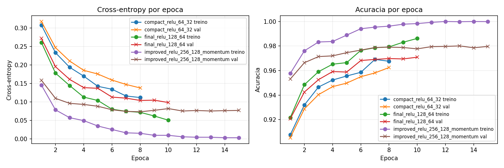
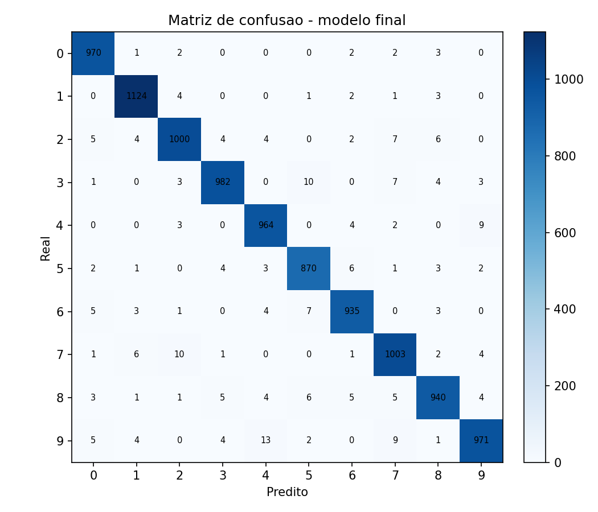

# Atividade Ponderada: MLP do zero em NumPy

Implementacao didatica de um Multi-Layer Perceptron para classificar digitos manuscritos do MNIST. A rede foi feita manualmente com NumPy: forward pass, softmax, cross-entropy, backpropagation e mini-batch SGD. O `torchvision` foi usado apenas para carregar o dataset, conforme permitido no enunciado.

Resultado final: **97.59% de acuracia no conjunto de teste**, acima da meta de 92%.

## Fontes de estudo

- [Teaching a Perceptron by Hand](https://thomascountz.com/2018/03/26/perceptrons-implementing-and-part-1), Thomas Countz: usei para partir do raciocinio de perceptron, pesos, vies e decisao.
- [Parameter optimization in neural networks](https://www.deeplearning.ai/ai-notes/optimization/index.html), DeepLearning.AI: usei para estruturar loss, custo medio, gradiente, learning rate e batch size.

## Estrutura do repositorio

```text
.
|-- mlp/
|   |-- activations.py
|   |-- data.py
|   |-- losses.py
|   |-- network.py
|   `-- optimizers.py
|-- notebooks/
|   `-- experimentos.ipynb
|-- results/
|   |-- confusion_matrix_final.png
|   |-- history_compact_relu_64_32.csv
|   |-- history_final_relu_128_64.csv
|   |-- loss_accuracy.png
|   |-- summary.csv
|   |-- summary.json
|   `-- train_full.log
|-- scripts/
|   `-- train.py
|-- tests/
|   |-- test_backprop.py
|   `-- test_forward.py
|-- README.md
`-- requirements.txt
```

## Como rodar

```powershell
python -m venv .venv
.\.venv\Scripts\Activate.ps1
pip install -r requirements.txt
python -m pytest tests
python scripts/train.py
```

Para validar rapidamente o pipeline sem retreinar tudo:

```powershell
python scripts/train.py --quick
```

O notebook principal esta em `notebooks/experimentos.ipynb`.

## Arquitetura escolhida

Modelo final:

```text
784 entradas -> 128 ReLU -> 64 ReLU -> 10 logits -> softmax
```

Decisoes:

- Usei **duas camadas ocultas** para cumprir o requisito minimo e aumentar a capacidade sem deixar o treino pesado demais.
- Usei **ReLU** nas camadas ocultas porque e simples, barata e evita boa parte da saturacao que sigmoid/tanh podem ter em redes maiores.
- Usei **inicializacao He** nas camadas ocultas para preservar melhor a escala dos sinais no comeco do treino.
- Usei **softmax + cross-entropy** na saida porque o problema e multiclasse.
- Usei **mini-batch SGD** com batch size 128 e decaimento simples do learning rate.

## Resultados

| Configuracao | Arquitetura | Epocas | LR inicial | Decaimento | Acuracia teste | Loss teste |
| --- | --- | ---: | ---: | ---: | ---: | ---: |
| `compact_relu_64_32` | 784 -> 64 -> 32 -> 10 | 8 | 0.08 | 0.96 | 96.34% | 0.1246 |
| `final_relu_128_64` | 784 -> 128 -> 64 -> 10 | 10 | 0.12 | 0.96 | **97.59%** | **0.0821** |





## Evolucao e pedras no caminho

| Marco | Commit | Pedra no caminho | O que eu decidi |
| --- | --- | --- | --- |
| Escopo inicial | `c318296` | O repositorio anterior era generico e ja tinha arquivos nao relacionados | Criar um repo publico dedicado: `C-Icaro/ponderada-mlp-mnist-numpy` |
| Inspecao do enunciado | `c318296` | Usei heredoc de Bash em PowerShell e a leitura falhou | Trocar para sintaxe nativa do PowerShell |
| Encoding | `c318296` | O console `cp1252` quebrou ao imprimir simbolos matematicos do notebook | Forcar stdout UTF-8 nas inspecoes |
| Forward pass | `ada5544` | Antes de treinar, eu precisava saber se as dimensoes batiam | Testar logits e soma da softmax antes do backprop |
| Backpropagation | `723c949` | A loss do MNIST so diria que algo estava errado, mas nao onde | Criar gradient check numerico em uma rede pequena |
| Dataset | `44dcb0a` | `tensorflow/keras` nao estava instalado no ambiente | Usar `torchvision.datasets.MNIST` apenas como loader e converter tudo para NumPy |
| Smoke test | `44dcb0a` | Eu nao queria gastar minutos no treino completo antes de validar o pipeline | Criar `--quick` para rodar em subconjunto pequeno |
| Treino completo | `5dfc65d` | O stdout ficou bufferizado em processo separado | Salvar CSV, JSON, PNG e log como evidencia principal |
| Notebook | `7685462` | O notebook precisava explicar processo, nao so mostrar codigo | Montar narrativa executavel com referencias, validacao e resultados |

## Decisoes e dificuldades

A decisao tecnica mais dificil foi **nao pular direto para o MNIST**. Eu queria ver a acuracia logo, mas isso teria tornado o debug confuso. Fiz primeiro o forward pass, depois o gradient check e so depois treinei no dataset real. Essa ordem foi mais lenta no comeco, mas evitou perder tempo tentando ajustar learning rate quando o problema poderia ser um gradiente errado.

O que tentei que nao funcionou: a primeira inspecao do notebook falhou por eu usar sintaxe de Bash dentro do PowerShell. Depois, a impressao do enunciado falhou por causa do encoding do terminal. Tambem descobri que `tensorflow/keras` nao estava disponivel, entao precisei usar Torchvision como fonte dos dados. Essas dificuldades nao mudaram a matematica da rede, mas mudaram o processo: passei a validar ambiente e caminhos antes de implementar cada etapa.

Se eu refizesse do zero, eu criaria desde o primeiro commit uma funcao de gradient check exposta no pacote, nao apenas nos testes. Tambem separaria melhor a camada de experimentos para fazer grid search maior sem alterar o notebook.

## Evidencias de verificacao

Comandos executados:

```powershell
python -m pytest tests
python scripts/train.py --quick
python scripts/train.py
```

Sinais observaveis:

- `tests/test_forward.py`: valida dimensoes e soma da softmax.
- `tests/test_backprop.py`: valida gradient check e queda de loss em problema pequeno.
- `results/summary.json`: registra acuracia final de teste.
- `results/train_full.log`: registra a evolucao por epoca no treino completo.
- `notebooks/experimentos.ipynb`: documenta o processo em formato notebook.

## Checklist dos requisitos

- [x] Forward pass para arquitetura com numero arbitrario de camadas
- [x] Backpropagation manual com gradientes validados por gradient check
- [x] SGD com learning rate configuravel
- [x] Treinamento completo no MNIST com acuracia maior que 92%
- [x] Curvas de loss e acuracia ao longo do treinamento
- [x] Comparacao de ao menos 2 configuracoes
- [x] README com arquitetura, resultados, decisoes e dificuldades
- [x] Historico com pelo menos 6 commits descritivos
- [x] Matriz de confusao comentada no notebook
