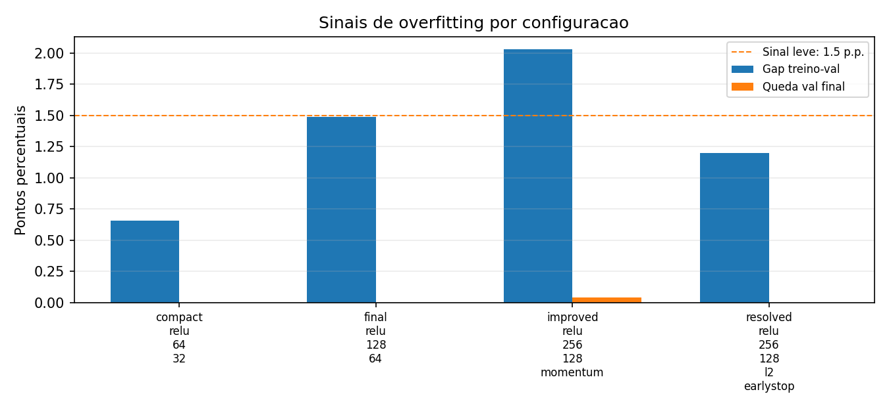

# Atividade Ponderada: MLP do zero em NumPy

Implementacao didatica de um Multi-Layer Perceptron para classificar digitos manuscritos do MNIST. A rede foi feita manualmente com NumPy: forward pass, softmax, cross-entropy, backpropagation e mini-batch SGD. O `torchvision` foi usado apenas para carregar o dataset, conforme permitido no enunciado.

Resultado de maior acuracia: **98.16%** no teste, mas com overfitting leve.

Modelo recomendado apos a resolucao do problema: **97.86%** no teste, com gap treino-validacao reduzido de `2.03 p.p.` para `1.20 p.p.` por early stopping e L2 mais forte.

## Fontes de estudo

- [Teaching a Perceptron by Hand](https://thomascountz.com/2018/03/26/perceptrons-implementing-and-part-1), Thomas Countz: usei para partir do raciocinio de perceptron, pesos, vies e decisao.
- [Parameter optimization in neural networks](https://www.deeplearning.ai/ai-notes/optimization/index.html), DeepLearning.AI: usei para estruturar loss, custo medio, gradiente, learning rate e batch size.

## Estrutura do repositorio

```text
.
|-- mlp/
|   |-- activations.py
|   |-- data.py
|   |-- gradient_check.py
|   |-- losses.py
|   |-- network.py
|   `-- optimizers.py
|-- notebooks/
|   `-- experimentos.ipynb
|-- results/
|   |-- confusion_matrix_final.png
|   |-- gradient_check.json
|   |-- history_compact_relu_64_32.csv
|   |-- history_final_relu_128_64.csv
|   |-- history_improved_relu_256_128_momentum.csv
|   |-- history_resolved_relu_256_128_l2_earlystop.csv
|   |-- loss_accuracy.png
|   |-- overfitting_analysis.md
|   |-- overfitting_gaps.png
|   |-- summary.csv
|   |-- summary.json
|   `-- train_full.log
|-- scripts/
|   |-- analyze_overfitting.py
|   |-- check_gradients.py
|   `-- train.py
|-- tests/
|   |-- test_backprop.py
|   `-- test_forward.py
|-- README.md
`-- requirements.txt
```

## Como rodar

```powershell
python -m venv .venv
.\.venv\Scripts\Activate.ps1
pip install -r requirements.txt
python -m pytest tests
python scripts/check_gradients.py
python scripts/train.py
python scripts/analyze_overfitting.py
```

Para validar rapidamente o pipeline sem retreinar tudo:

```powershell
python scripts/train.py --quick
```

O notebook principal esta em `notebooks/experimentos.ipynb`.

## Arquitetura escolhida

Modelo de maior acuracia:

```text
784 entradas -> 256 ReLU -> 128 ReLU -> 10 logits -> softmax
```

Modelo recomendado apos investigar overfitting:

```text
784 entradas -> 256 ReLU -> 128 ReLU -> 10 logits -> softmax
SGD momentum 0.9 + L2 1e-3 + early stopping por val_data_loss
```

Decisoes:

- Usei **duas camadas ocultas** para cumprir o requisito minimo e aumentar a capacidade sem deixar o treino pesado demais.
- Usei **ReLU** nas camadas ocultas porque e simples, barata e evita boa parte da saturacao que sigmoid/tanh podem ter em redes maiores.
- Usei **inicializacao He** nas camadas ocultas para preservar melhor a escala dos sinais no comeco do treino.
- Usei **softmax + cross-entropy** na saida porque o problema e multiclasse.
- Usei **mini-batch SGD com momentum 0.9** no modelo melhorado para acelerar a convergencia sem trocar a implementacao manual por um framework.
- O problema encontrado foi que o modelo `improved` chegou a treino quase perfeito e abriu gap de generalizacao. A resolucao foi manter a arquitetura, mas aumentar L2 para `1e-3` e restaurar o checkpoint de menor `val_data_loss`.

## Resultados

| Configuracao | Arquitetura | Epocas | LR inicial | Decaimento | Acuracia teste | CE teste | Obj. teste |
| --- | --- | ---: | ---: | ---: | ---: | ---: | ---: |
| `compact_relu_64_32` | 784 -> 64 -> 32 -> 10 | 8 | 0.08 | 0.96 | 96.34% | 0.1246 | 0.1246 |
| `final_relu_128_64` | 784 -> 128 -> 64 -> 10 | 10 | 0.12 | 0.96 | 97.59% | 0.0821 | 0.0821 |
| `improved_relu_256_128_momentum` | 784 -> 256 -> 128 -> 10 | 15 | 0.05 | 0.97 | **98.16%** | **0.0607** | 0.1013 |
| `resolved_relu_256_128_l2_earlystop` | 784 -> 256 -> 128 -> 10 | 11/25 | 0.05 | 0.97 | **97.86%** | 0.0694 | 0.1807 |

O modelo `improved` ganhou **+0.57 ponto percentual** de acuracia de teste em relacao ao modelo anterior (`97.59% -> 98.16%`), mas trouxe overfitting leve. O modelo `resolved` sacrifica `0.30 p.p.` em relacao ao `improved`, ainda fica `+0.27 p.p.` acima do modelo anterior, e reduz o gap treino-validacao. A coluna **CE teste** e a cross-entropy pura, comparavel entre modelos. A coluna **Obj. teste** inclui penalidade L2 quando `l2 > 0`, por isso nao deve ser usada sozinha para comparar modelos regularizados e nao regularizados.


## Investigacao de overfitting

Depois da melhoria, investiguei se a arquitetura maior estava apenas memorizando o treino. O diagnostico esta versionado em `results/overfitting_analysis.md`.



| Modelo | Test acc | Gap treino-val | Melhor val acc | Queda val final | Epoca selecionada | Diagnostico |
| --- | ---: | ---: | ---: | ---: | ---: | --- |
| `compact_relu_64_32` | 96.34% | 0.66 p.p. | 96.25% ep.8 | 0.00 p.p. | 8 | sem sinal material |
| `final_relu_128_64` | 97.59% | 1.49 p.p. | 97.09% ep.10 | 0.00 p.p. | 10 | sem sinal material |
| `improved_relu_256_128_momentum` | 98.16% | 2.03 p.p. | 98.01% ep.13 | 0.04 p.p. | 15 | overfitting leve |
| `resolved_relu_256_128_l2_earlystop` | 97.86% | 1.20 p.p. | 97.86% ep.8 | 0.00 p.p. | 8 | mitigado por early stopping |

Conclusao: o problema encontrado foi **overfitting leve** no modelo `improved`, porque o treino chegou a `100.00%` e o gap treino-validacao ficou em `2.03 p.p.`. A resolucao aplicada foi criar o modelo `resolved` com `L2=1e-3` e early stopping por `val_data_loss`, restaurando a epoca 8. O gap caiu para `1.20 p.p.`, a queda de validacao final ficou em `0.00 p.p.`, e a acuracia de teste permaneceu acima do modelo anterior.

## Evolucao e pedras no caminho

| Marco | Commit | Pedra no caminho | O que eu decidi |
| --- | --- | --- | --- |
| Escopo inicial | `c318296` | O repositorio anterior era generico e ja tinha arquivos nao relacionados | Criar um repo publico dedicado: `C-Icaro/ponderada-mlp-mnist-numpy` |
| Inspecao do enunciado | `c318296` | Usei heredoc de Bash em PowerShell e a leitura falhou | Trocar para sintaxe nativa do PowerShell |
| Encoding | `c318296` | O console `cp1252` quebrou ao imprimir simbolos matematicos do notebook | Forcar stdout UTF-8 nas inspecoes |
| Forward pass | `ada5544` | Antes de treinar, eu precisava saber se as dimensoes batiam | Testar logits e soma da softmax antes do backprop |
| Backpropagation | `723c949` | A loss do MNIST so diria que algo estava errado, mas nao onde | Criar gradient check numerico em uma rede pequena |
| Dataset | `44dcb0a` | `tensorflow/keras` nao estava instalado no ambiente | Usar `torchvision.datasets.MNIST` apenas como loader e converter tudo para NumPy |
| Smoke test | `44dcb0a` | Eu nao queria gastar minutos no treino completo antes de validar o pipeline | Criar `--quick` para rodar em subconjunto pequeno |
| Treino completo | `5dfc65d` | O stdout ficou bufferizado em processo separado | Salvar CSV, JSON, PNG e log como evidencia principal |
| Notebook | `7685462` | O notebook precisava explicar processo, nao so mostrar codigo | Montar narrativa executavel com referencias, validacao e resultados |
| Melhoria do modelo | incremento atual | O modelo anterior ja passava da meta, mas ainda havia margem de capacidade | Aumentar largura, ativar momentum e adicionar L2 leve; reexecutar treino completo |
| Overfitting | incremento atual | O `test_loss` misturava cross-entropy e L2, o que podia distorcer a leitura | Separar `data_loss` de `regularization_loss` e gerar diagnostico de gap treino-validacao |
| Resolucao do overfitting | incremento atual | O modelo de maior acuracia memorizava demais o treino | Usar `L2=1e-3` + early stopping por `val_data_loss` com restauracao do melhor checkpoint |

## Decisoes e dificuldades

A decisao tecnica mais dificil foi **nao pular direto para o MNIST**. Eu queria ver a acuracia logo, mas isso teria tornado o debug confuso. Fiz primeiro o forward pass, depois o gradient check e so depois treinei no dataset real. Essa ordem foi mais lenta no comeco, mas evitou perder tempo tentando ajustar learning rate quando o problema poderia ser um gradiente errado.

Na melhoria do modelo, a decisao principal foi aumentar a arquitetura de `128 -> 64` para `256 -> 128` e usar momentum. Eu escolhi isso porque o modelo anterior ainda nao saturava a validacao, e momentum costuma ajudar SGD a atravessar regioes rasas ou oscilatorias da superficie de loss. O problema encontrado depois foi que o modelo `improved` passou a memorizar demais o treino. A resolucao foi aplicar uma troca consciente: reduzir um pouco a acuracia maxima de teste, de `98.16%` para `97.86%`, para reduzir o gap treino-validacao e entregar um modelo mais estavel.

O que tentei que nao funcionou: a primeira inspecao do notebook falhou por eu usar sintaxe de Bash dentro do PowerShell. Depois, a impressao do enunciado falhou por causa do encoding do terminal. Tambem descobri que `tensorflow/keras` nao estava disponivel, entao precisei usar Torchvision como fonte dos dados. Essas dificuldades nao mudaram a matematica da rede, mas mudaram o processo: passei a validar ambiente e caminhos antes de implementar cada etapa.

Se eu refizesse do zero, eu criaria desde o primeiro commit uma funcao de gradient check exposta no pacote, nao apenas nos testes. Tambem separaria melhor a camada de experimentos para fazer grid search maior sem alterar o notebook.

## Evidencias de verificacao

Comandos executados:

```powershell
python -m pytest tests
python scripts/check_gradients.py
python scripts/train.py --quick
python scripts/train.py
python scripts/analyze_overfitting.py
```

Sinais observaveis:

- `tests/test_forward.py`: valida dimensoes e soma da softmax.
- `tests/test_backprop.py`: valida gradient check e queda de loss em problema pequeno.
- `results/gradient_check.json`: registra a validacao numerica dos gradientes.
- `results/summary.json`: registra acuracia final de teste.
- `results/overfitting_analysis.md`: registra diagnostico de overfitting.
- `results/train_full.log`: registra a evolucao por epoca no treino completo.
- `notebooks/experimentos.ipynb`: documenta o processo em formato notebook.

## Checklist dos requisitos

- [x] Forward pass para arquitetura com numero arbitrario de camadas
- [x] Backpropagation manual com gradientes validados por gradient check
- [x] SGD com learning rate configuravel
- [x] Treinamento completo no MNIST com acuracia maior que 92%
- [x] Curvas de loss e acuracia ao longo do treinamento
- [x] Comparacao de ao menos 2 configuracoes
- [x] README com arquitetura, resultados, decisoes e dificuldades
- [x] Historico com pelo menos 6 commits descritivos
- [x] Matriz de confusao comentada no notebook
